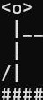

# Fancy Fencing

## Presentation

This is a game inspired by fencing. touch your oponent with your sword to score ! The first to 15 wins !


## Run

__Everything must be done inside *'pa_fencing'* directory__

```
pyhton3 main.py
``` 

### How to launch a game

#### Start a new game :

You will chose **P** To play. Then chose a stage cointained in a ***.ffscene*** file(you can skip and the game will chose the default stage)


Then you will chose a character for each player. Each character has a different asset of stats, **Fast Arm** will attack and block for a longer time, **Fast legs** moves faster etc... 


At the end you chose the frame rate. Be careful everything is based on frame per second. If you are to fast it won't be very enjoyable.


I recommand ***fps*** being in between 20 and 40


You can play with your friend now!


#### Load a Game :

To Load a game you chose **L** to load a saved game. After you have to type the name of your ***save***.


You enter the **frame rate** and the game starts.


### In Game :

The goal is to score **15** by attacking your opponent. Be careful he can block so that you don't score. Your score is on top of the stage.

The differente stat of players :

   
Attack - Block - Rest
To see the commands for each players you juste have to press **F1**, a menu will appear with the commands.


You can also leave the game and save it or not. However it can only be done inside the ***Pause Menu***.

To save a game you just have to press **W** and the enter a *name* for your save. If the *name* you writte is taken the game will ask you for another game until it's good.


Done by ***Jules Cherion*** for **Advanced Programmation** course in 2022